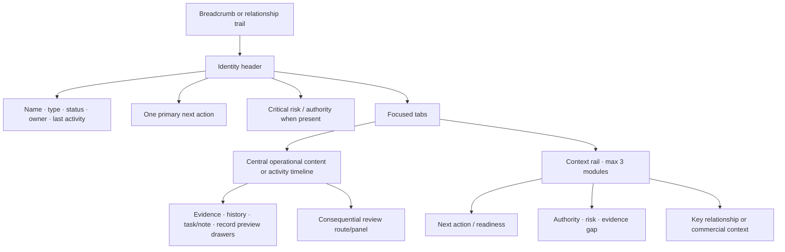

# Relationship Detail Anatomy

```mermaid
flowchart TB
  Trail["Breadcrumb or relationship trail"] --> Header["Identity header"]
  Header --> Identity["Name · type · status · owner · last activity"]
  Header --> Primary["One primary next action"]
  Header --> Critical["Critical risk / authority when present"]
  Header --> Tabs["Focused tabs"]
  Tabs --> Main["Central operational content or activity timeline"]
  Tabs --> Rail["Context rail · max 3 modules"]
  Rail --> Next["Next action / readiness"]
  Rail --> Block["Authority · risk · evidence gap"]
  Rail --> Relation["Key relationship or commercial context"]
  Main --> Drawers["Evidence · history · task/note · record preview drawers"]
  Main --> Review["Consequential review route/panel"]
```

At widths below 1280 px, ContextRail becomes a drawer. On mobile, identity summary and next action precede tabs; drawers become full-screen.

