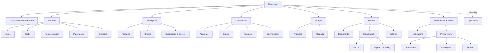

# Navigation Architecture Diagram

```mermaid
flowchart TD
  Shell["Ryva shell"] --> Search["Global search / command"]
  Shell --> Operate["Operate"]
  Shell --> Intelligence["Intelligence"]
  Shell --> Commercial["Commercial"]
  Shell --> Analyze["Analyze"]
  Shell --> System["System"]
  Shell --> Utilities["Notifications + profile"]
  Shell -. capability .-> Operations["Operations"]

  Operate --> Home["Home"]
  Operate --> Tasks["Tasks"]
  Operate --> Representation["Representation"]
  Operate --> Placements["Placements"]
  Operate --> Outreach["Outreach"]

  Intelligence --> Products["Products"]
  Intelligence --> Brands["Brands"]
  Intelligence --> Buyers["Businesses & Buyers"]

  Commercial --> Accounts["Accounts"]
  Commercial --> Orders["Orders"]
  Commercial --> Reorders["Reorders"]
  Commercial --> Commissions["Commissions"]

  Analyze --> Analytics["Analytics"]
  Analyze --> Reports["Reports"]

  System --> Documents["Documents"]
  System --> Transfer["Data transfer"]
  Transfer --> Imports["Import"]
  Transfer --> Exports["Export · capability"]
  System --> Settings["Settings"]

  Utilities --> Notifications["Notifications"]
  Utilities --> Profile["Profile menu"]
  Profile --> Certification["Certification"]
  Profile --> Subscription["Subscription"]
  Profile --> SignOut["Sign out"]
```

Mobile exposes Home, Tasks, Placements, Search, and More in bottom navigation. More contains the same grouped hierarchy and profile/security actions.

