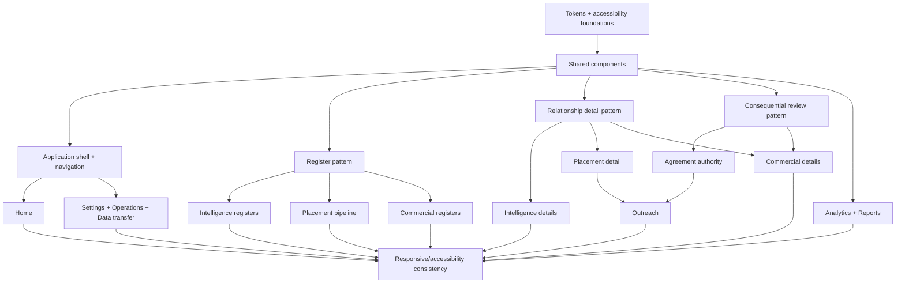

# Redesign Dependency Diagram

```mermaid
flowchart TD
  T["Tokens + accessibility foundations"] --> C["Shared components"]
  C --> S["Application shell + navigation"]
  C --> R["Register pattern"]
  C --> D["Relationship detail pattern"]
  C --> Q["Consequential review pattern"]
  S --> H["Home"]
  R --> I["Intelligence registers"]
  D --> ID["Intelligence details"]
  R --> P["Placement pipeline"]
  D --> PD["Placement detail"]
  Q --> A["Agreement authority"]
  PD --> O["Outreach"]
  A --> O
  R --> COM["Commercial registers"]
  D --> COMD["Commercial details"]
  Q --> COMD
  C --> AN["Analytics + Reports"]
  S --> SYS["Settings + Operations + Data transfer"]
  H --> FINAL["Responsive/accessibility consistency"]
  I --> FINAL
  ID --> FINAL
  P --> FINAL
  O --> FINAL
  COM --> FINAL
  COMD --> FINAL
  AN --> FINAL
  SYS --> FINAL
```

No legacy component is removed until its migrated callers pass functional, authorization, accessibility, and visual-regression tests.

