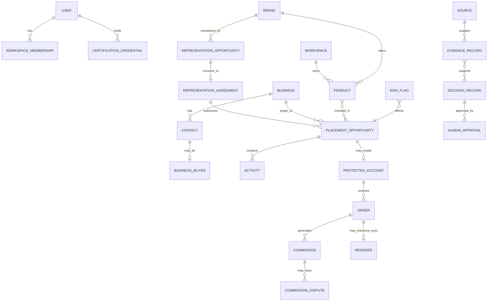

# Connected Data Model

## Modeling principles

- typed relational entities for the profession;
- one connected record without merging distinct decisions;
- `workspace_id` on tenant-owned data;
- Product, Brand, Business, Contact, mandate, Opportunity, account, order, and commission remain separate;
- facts, estimates, AI suggestions, and human decisions are distinguishable;
- state changes are events with actors and timestamps;
- soft archive for professional continuity; controlled deletion for personal data;
- JSONB is bounded, not a substitute for schema.

## Relationship overview

## Entity registry

| Entity | Purpose | Primary statuses | Owner | Retention summary |
|---|---|---|---|---|
| User | Identity and account | active, disabled, deleted | Person/Ryva identity service | Account term plus legal/security period |
| Workspace | Tenant boundary | active, read-only, closed | User | Professional records per export/deletion policy |
| Workspace Membership | Role/capabilities | active, suspended, ended | Workspace/admin | Audit duration |
| Certification Credential | Access entitlement | pending, active, expiring, expired, suspended, revoked, surrendered | Credential authority | Credential history retained |
| Subscription | Billing entitlement | trial, active, past_due, canceled, ended | User/Ryva billing | Financial retention |
| Product | Product intelligence object | discovered, under_review, qualified, rejected, represented, archived | Workspace | Until archived/deleted subject to evidence |
| Brand | Company intelligence object | discovered through ended/rejected | Workspace | Professional relationship retention |
| Business | Commercial organization/account candidate | research, qualified, active, inactive, closed | Workspace | Professional relationship retention |
| Contact | Person at Brand/Business | unverified, verified, stale, opted_out, inactive | Workspace | Purpose-limited; delete/anonymize as required |
| Business Buyer | Contact's decision role | unknown, influencer, evaluator, decision_maker, authorized_purchaser | Workspace | With Contact |
| Source | Evidence provenance | active, inaccessible, corrected, deleted | Workspace/system | According to rights |
| Evidence Record | Claim-level evidence | current, stale, disputed, superseded | Reviewer | Decision/audit period |
| Representation Opportunity | Potential Brand mandate | discovered, researching, contact_ready, contacted, conversation, reviewing_terms, rejected, converted | Workspace | Relationship history |
| Representation Agreement | Actual authority | draft, pending_approval, active, suspended, expired, ended | Workspace | Contractual/legal period |
| Territory | Agreement scope | proposed, active, expired, ended | Agreement | With agreement |
| Placement Opportunity | Specific Brand–Business pursuit | identified through disqualified/closed_lost/active | Representative | Commercial history |
| Placement Stage Event | Stage transition | entered, reversed, corrected | System/user | Append-only |
| Activity | Unified commercial history item | planned, completed, canceled, failed | Actor | Professional record period |
| Task | Owned next action | open, in_progress, blocked, completed, canceled | Assignee | History retained |
| Email | Draft/send/receive record | draft, approved, queued, sent, delivered, failed, replied, opted_out | Representative | Communications policy |
| Call | Call preparation/log | planned, completed, no_answer, voicemail, canceled | Representative | Communications policy |
| Note | Factual user note | active, edited, archived | Author | With parent |
| Outreach Sequence | Follow-up plan | draft, active, paused, completed, stopped | Representative | History retained |
| Template | Reusable content | draft, active, archived | Workspace/Ryva | Until archived |
| Protected Account | Agreement-derived protection record | pending, active, expiring, expired, disputed, released, ended | Representative/Admin approval | Contractual and dispute period |
| Account | Active Brand–Business relationship | onboarding, active, at_risk, paused, ended | Representative | Commercial history |
| Order | Verified commercial order | draft, submitted, confirmed, fulfilled, partially_returned, returned, canceled | Representative | Financial retention |
| Reorder | Review/event linked to prior order | projected, due, contacted, ordered, deferred, not_expected, closed | Representative | Commercial history |
| Commission | Explainable compensation | estimated, pending_verification, approved, payable, paid, disputed, canceled, clawed_back | Representative | Financial retention |
| Commission Dispute | Disputed calculation/payment | opened, evidence_needed, submitted, under_review, resolved, rejected, withdrawn | Representative | Financial/dispute retention |
| Risk Flag | Material risk/gate | open, reviewing, mitigated, accepted, closed | Named owner | With affected decision |
| Decision Record | Human decision and rationale | draft, issued, superseded | Decision owner | Append-only versions |
| Human Approval | Exact approval | requested, approved, rejected, changes_required, expired | Approver | Append-only |
| AI Suggestion | Reviewable model output | generated, accepted, edited, rejected, expired | Requesting user | Evaluation/audit period |
| Audit Event | Immutable state/action trace | recorded | System | Security/legal schedule |
| Saved View | User query/layout | active, archived | User/workspace | Until deleted |
| Notification | User attention item | unread, read, dismissed, resolved | User | Short operational retention |
| Document | File and metadata | uploading, scanning, active, quarantined, archived, deleted | Workspace | Type-specific |
| Import Job | Validated bulk import | uploaded, mapping, validating, ready, committing, completed, failed | User | Raw file short-lived |
| Export Job | Controlled export | requested, processing, ready, expired, failed | User/admin | Package short-lived; audit retained |
| Integration Connection | Provider identity/tokens | pending, connected, degraded, expired, revoked, disconnected | User | Secrets deleted on disconnect |

## Ownership

All tenant data belongs to one workspace. The Representative is the default record owner. Assignment may be delegated only if future team membership is enabled. System-owned events and calculations identify their originating actor or rule.

## Flexible fields

The first version supports bounded custom fields on Product, Brand, Business, Contact, Placement Opportunity, Account, and Order:

- text;
- number;
- date;
- single select;
- multi-select;
- URL;
- boolean.

No custom relationships, formulas, scripts, or arbitrary object builder. Custom-field definitions are workspace-scoped, typed, audited, and included in export.

## Data integrity

- one active canonical Brand per normalized identity within workspace;
- one active canonical Business per normalized identity/location grouping;
- Contact email unique per workspace when verified, with merge support;
- Placement Opportunity unique warning for same agreement, Business, and active Product set;
- Protected Account conflicts checked by Brand, Business, Product scope, territory, channel, and date;
- order external reference idempotent per Brand/source;
- commission calculation versioned and never overwritten.

