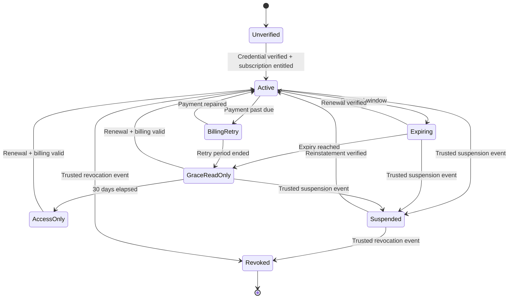

# Access State Diagram

```mermaid
stateDiagram-v2
  [*] --> Unverified
  Unverified --> Active: Credential verified + subscription entitled
  Active --> Expiring: Renewal window
  Expiring --> Active: Renewal verified
  Expiring --> GraceReadOnly: Expiry reached
  GraceReadOnly --> Active: Renewal + billing valid
  GraceReadOnly --> AccessOnly: 30 days elapsed
  Active --> Suspended: Trusted suspension event
  Expiring --> Suspended: Trusted suspension event
  GraceReadOnly --> Suspended: Trusted suspension event
  Suspended --> Active: Reinstatement verified
  Suspended --> Revoked: Trusted revocation event
  Active --> Revoked: Trusted revocation event
  AccessOnly --> Active: Renewal + billing valid
  Active --> BillingRetry: Payment past due
  BillingRetry --> Active: Payment repaired
  BillingRetry --> GraceReadOnly: Retry period ended
  Revoked --> [*]
```

`AccessOnly` provides certification, subscription, permitted export request, and support. No operational or external action.

