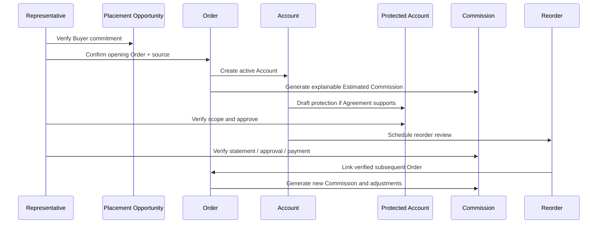

# Commercial Continuity Diagram

```mermaid
sequenceDiagram
  participant R as Representative
  participant P as Placement Opportunity
  participant O as Order
  participant A as Account
  participant PA as Protected Account
  participant C as Commission
  participant RE as Reorder

  R->>P: Verify Buyer commitment
  R->>O: Confirm opening Order + source
  O->>A: Create active Account
  O->>C: Generate explainable Estimated Commission
  A->>PA: Draft protection if Agreement supports
  R->>PA: Verify scope and approve
  A->>RE: Schedule reorder review
  R->>C: Verify statement / approval / payment
  RE->>O: Link verified subsequent Order
  O->>C: Generate new Commission and adjustments
```

All conversions are idempotent, transactional where possible, and audited. Protection approval is separate from Order verification.

