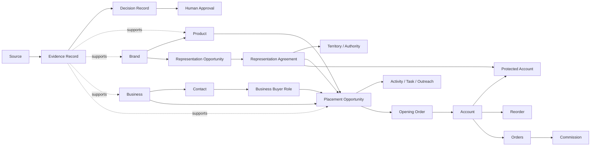

# Core Entity Relationships

```mermaid
flowchart LR
  B["Brand"] --> P["Product"]
  B --> RO["Representation Opportunity"]
  RO --> RA["Representation Agreement"]
  RA --> T["Territory / Authority"]
  BU["Business"] --> C["Contact"]
  C --> BY["Business Buyer Role"]
  RA --> PO["Placement Opportunity"]
  P --> PO
  BU --> PO
  BY --> PO
  PO --> ACT["Activity / Task / Outreach"]
  PO --> ORD["Opening Order"]
  ORD --> ACC["Account"]
  RA --> PA["Protected Account"]
  ACC --> PA
  ACC --> RE["Reorder"]
  ACC --> O2["Orders"]
  O2 --> COM["Commission"]
  SRC["Source"] --> EV["Evidence Record"]
  EV --> DEC["Decision Record"]
  DEC --> APP["Human Approval"]
  EV -. supports .-> P
  EV -. supports .-> B
  EV -. supports .-> BU
  EV -. supports .-> PO
```

The graph is connected but does not merge distinct decisions. An opening Order creates Account continuity; it does not erase the Opportunity.

