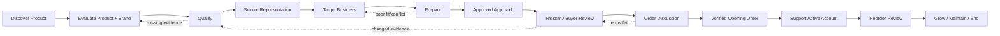

# Placement Lifecycle Diagram

```mermaid
flowchart LR
  D["Discover Product"] --> E["Evaluate Product + Brand"]
  E --> Q["Qualify"]
  Q --> R["Secure Representation"]
  R --> T["Target Business"]
  T --> PR["Prepare"]
  PR --> A["Approved Approach"]
  A --> P["Present / Buyer Review"]
  P --> O["Order Discussion"]
  O --> OO["Verified Opening Order"]
  OO --> S["Support Active Account"]
  S --> RE["Reorder Review"]
  RE --> G["Grow / Maintain / End"]
  Q -. missing evidence .-> E
  PR -. poor fit/conflict .-> T
  P -. changed evidence .-> Q
  O -. terms fail .-> P
```

The CRM pipeline uses finer states for communication and samples while remaining mapped to the Placement Cycle.

