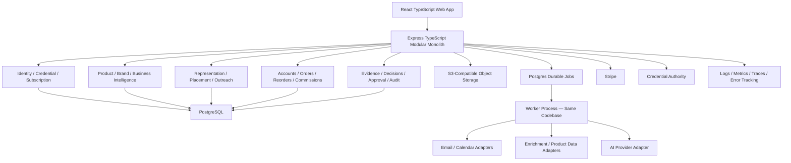

# System Architecture Diagram

```mermaid
flowchart TB
  WEB["React TypeScript Web App"] --> API["Express TypeScript Modular Monolith"]
  API --> IAM["Identity / Credential / Subscription"]
  API --> INTEL["Product / Brand / Business Intelligence"]
  API --> CRM["Representation / Placement / Outreach"]
  API --> COMM["Accounts / Orders / Reorders / Commissions"]
  API --> GOV["Evidence / Decisions / Approval / Audit"]
  IAM --> PG["PostgreSQL"]
  INTEL --> PG
  CRM --> PG
  COMM --> PG
  GOV --> PG
  API --> OBJ["S3-Compatible Object Storage"]
  API --> JOBS["Postgres Durable Jobs"]
  JOBS --> WORKER["Worker Process — Same Codebase"]
  WORKER --> EMAIL["Email / Calendar Adapters"]
  WORKER --> DATA["Enrichment / Product Data Adapters"]
  WORKER --> AI["AI Provider Adapter"]
  API --> STRIPE["Stripe"]
  API --> CERT["Credential Authority"]
  API --> OBS["Logs / Metrics / Traces / Error Tracking"]
```

The worker can prepare, sync, notify, calculate, and send only after policy and approval. Provider content cannot grant authority.

