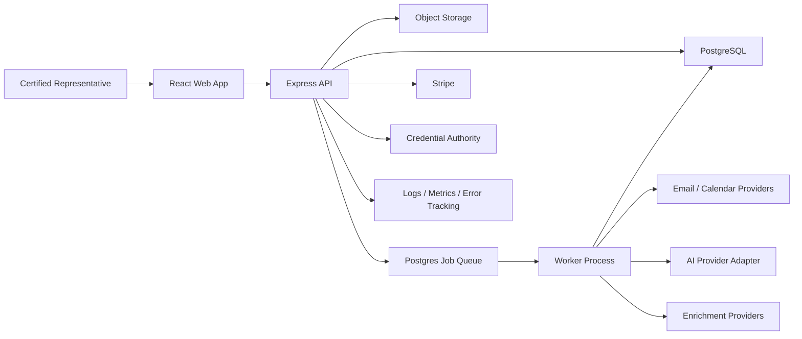

# Technical Architecture

## Architecture

Ryva Pro is a TypeScript modular monolith with a React web application, Express API, PostgreSQL database, Postgres-backed worker, and object storage.

## Frontend

- React, TypeScript, Vite;
- route-based code splitting;
- accessible component system owned by Ryva;
- server-state query/cache library;
- schema-based forms and validation;
- URL-addressable filters and saved views;
- optimistic updates only for reversible internal actions;
- no optimistic external sends, approvals, orders, or commission state.

## Backend

- Express 5 in TypeScript;
- REST resources and explicit command endpoints;
- domain modules with service, repository, policy, and event layers;
- transaction boundary per command;
- input and output schema validation;
- idempotency keys for imports, sends, provider events, order creation, and commission generation;
- problem-details error responses;
- cursor pagination.

## Persistence

- PostgreSQL only;
- UUID primary keys;
- `workspace_id` on tenant records;
- UTC timestamptz;
- typed columns for core operational fields;
- JSONB only for source payload excerpts, bounded custom fields, provider metadata, and formula snapshots;
- database constraints for state, ownership, and uniqueness;
- append-only audit and decision history;
- soft archive for professional records; legal deletion workflows for personal data.

## Search

Use PostgreSQL full-text search plus trigram indexes for names, identifiers, notes, and document metadata. Search respects record permissions and excludes raw attachment content until text extraction is approved.

## Jobs

Postgres-backed jobs handle:

- imports;
- provider sync;
- email send after human approval;
- follow-up and reorder reminders;
- commission due checks;
- evidence freshness;
- document extraction;
- AI assistance;
- notifications;
- exports;
- deduplication suggestions.

Jobs are leased, retryable, idempotent, observable, and dead-lettered after bounded failure.

## Integrations

Adapters isolate:

- credential verification;
- Stripe;
- email and calendar;
- contact/business enrichment;
- Product and social data;
- object storage;
- AI providers.

An integration grants technical access only. User permission and domain policy remain separate.

## AI enforcement

AI produces suggestions, never authority. The service layer:

- selects authorized compact evidence;
- removes secrets;
- validates structured output;
- stores provenance and model version;
- prevents external side effects;
- requires human approval for material adoption;
- audits acceptance, edits, rejection, regeneration, and feedback.

## Security

- secure HttpOnly SameSite cookies;
- password hashing and optional OAuth;
- CSRF/origin protection;
- rate limiting;
- least-privilege provider scopes;
- encrypted credentials and sensitive fields;
- signed upload/download URLs;
- malware scanning;
- tenant-scoped queries;
- support impersonation prohibited; time-boxed audited support access only;
- secrets manager in production.

## Observability

Structured logs, metrics, traces, error tracking, job dashboards, provider health, audit-integrity alerts, and business-state reconciliation. Sensitive content and secrets are redacted.

## Delivery environments

- local development;
- ephemeral/isolated test;
- staging with non-production providers;
- production.

Migrations run as controlled release steps. Backward-compatible application deployment precedes destructive schema change.

